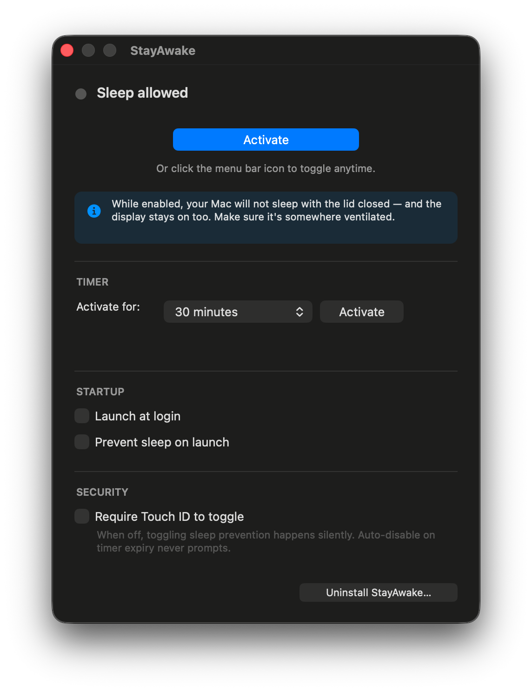

<div align="center">


# StayAwake

**Keep your Mac awake — even with the lid closed.**

Built so your background agents, training jobs, and long-running tasks don't die when you walk away.

[Install](#install) · [Uninstall](#uninstall) · [How it works](#how-it-works)

</div>

---

## Why this exists

macOS aggressively sleeps when you close the lid. That's a problem if you rely on background work continuing — Claude Code agents, long builds, model downloads, syncing, `rsync` jobs, training runs.

Apple's own *Power Mode* and tools like Caffeine **don't actually defeat clamshell sleep**. The only reliable knob is `pmset disablesleep 1`, which requires `sudo`. StayAwake wraps that one toggle in a clean menu bar app so you can enable/disable it like any other utility — no terminals, no sticky notes with passwords.

> **Close the lid. Walk away. Your agents keep running.**

---

## Features

- 🔥 **Closed-lid mode that actually works** — uses `pmset disablesleep`, the only macOS API that defeats clamshell sleep
- 🖥️ **Display stays on too** — useful if you VNC/Screen-Share into the machine while away
- 👆 **Touch ID instead of typing your password** every toggle — installs a tightly scoped passwordless `sudoers` rule the first time
- 🍎 **Menu bar only** — no Dock icon, no window unless you want one
- 🚀 **Launch at login** + optional auto-activate on launch
- 🧹 **Clean uninstall** — one button removes the app, the helper rule, and all preferences
- 📦 **Tiny** — single Swift binary, no external dependencies, ~200 KB built

---

## Screenshots

<table>
<tr>
<td align="center"><b>Inactive</b></td>
<td align="center"><b>Active</b></td>
</tr>
<tr>
<td align="center"></td>
<td align="center"></td>
</tr>
<tr>
<td align="center"><sub>System sleep allowed</sub></td>
<td align="center"><sub>System sleep prevented</sub></td>
</tr>
</table>

<p align="center">
  
</p>

---

## Install

### Download (recommended)

Requires macOS 13+ on Apple Silicon. No build tools needed.

1. Download **`StayAwake.zip`** from the [latest release](https://github.com/shamrai-nikita/StayAwake/releases/latest).
2. Unzip and drag **StayAwake.app** into `/Applications`.
3. **Right-click → Open** the first time. Gatekeeper warns because the app is locally codesigned (no Apple Developer ID) — choose Open to bypass it once.
4. On first launch you'll be prompted for your admin password once to install a Touch ID helper. Every toggle after that uses Touch ID.

### From source

Requires macOS 13+ on Apple Silicon and Xcode Command Line Tools (`xcode-select --install`).

```bash
git clone https://github.com/shamrai-nikita/StayAwake.git
cd StayAwake
make install
```

That copies `StayAwake.app` to `/Applications`. Open it once to grant Touch ID access — on first run it offers to install a passwordless `pmset` helper at `/etc/sudoers.d/stayawake` so future toggles don't ask for your password.

---

## Usage

- **Left-click** the menu bar icon → toggle sleep prevention on/off
  - 🟧 colorful eye = sleep prevented
  - ⚪ outline eye = sleep allowed
- **Right-click** the menu bar icon → Preferences / Quit
- The Preferences window has:
  - A big **Enable / Disable** button
  - **Launch at login**
  - **Prevent sleep on launch** — auto-activate every time the app starts
  - An **Uninstall StayAwake…** button (see below)

---

## Uninstall

Open Preferences and click **Uninstall StayAwake…** at the bottom. It will:

1. Re-enable system sleep (`pmset -a disablesleep 0`)
2. Remove the Touch ID helper (`/etc/sudoers.d/stayawake`)
3. Remove `StayAwake.app` from `/Applications`
4. Disable launch-at-login
5. Clear all StayAwake preferences

You'll be asked for your admin password once, and the app will quit immediately after.

If you'd rather do it manually:

```bash
sudo pmset -a disablesleep 0
sudo rm -f /etc/sudoers.d/stayawake
rm -rf /Applications/StayAwake.app
defaults delete com.nikitash.stayawake
```

---

## How it works

| Layer | What it uses |
|---|---|
| Sleep prevention | `pmset -a disablesleep 1/0` invoked via `sudo` (no password thanks to the helper rule) |
| Auth gate | `LAContext.evaluatePolicy(.deviceOwnerAuthenticationWithBiometrics)` — Touch ID required for every toggle |
| Menu bar | `NSStatusItem` with custom `NSImage` rendered from PNG assets (chroma-keyed black background → transparent) |
| Login item | `SMAppService.mainApp` (macOS 13+) |
| Bundling | Plain `swiftc` + `iconutil`, packaged into a `.app` directory by a `Makefile` — no Xcode project, no SwiftPM |

### Project layout

```
StayAwake/
├── Sources/
│   ├── main.swift                       — entry point
│   ├── AppDelegate.swift                — wires managers together
│   ├── SleepManager.swift               — pmset toggle + Touch ID
│   ├── StatusBarManager.swift           — menu bar icon + click dispatch
│   ├── LoginItemManager.swift           — SMAppService wrapper
│   ├── PreferencesWindowController.swift — settings window (no nib)
│   ├── HelperInstaller.swift            — first-run sudoers helper install
│   └── Icons.swift                      — PNG → menu-bar NSImage pipeline
├── Resources/
│   ├── Info.plist                       — LSUIElement=YES (menu-bar-only)
│   ├── AppIcon.png                      — source for the .icns
│   ├── MenuBarEye.png                   — active state (color)
│   └── MenuBarEyeOutline.png            — inactive state (template)
├── tools/
│   └── generate_icon.swift              — auto-crops & renders the iconset
└── Makefile                             — build / install / clean / run
```

---

## Security notes

- The sudoers rule grants passwordless `sudo` **only** for `/usr/bin/pmset`. It cannot be used to escalate to anything else.
- Every toggle still requires Touch ID, so even with passwordless sudo a passerby can't flip your sleep settings.
- The app is locally codesigned (`codesign --sign -`) — Gatekeeper will warn the first time you open it. Right-click → Open to allow.
- No telemetry, no network calls, no analytics. The app never touches the network.

---

## License

MIT — see [LICENSE](LICENSE).
